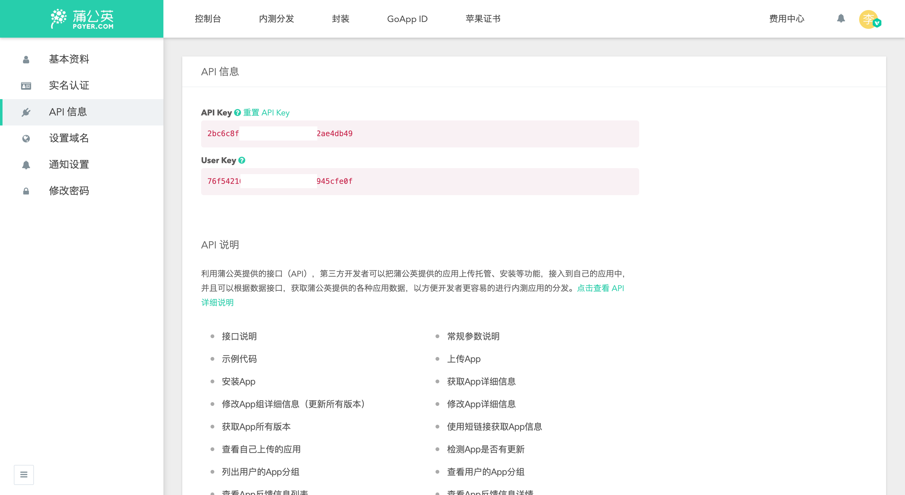

# 开始

## 安装

```
dart pub global activate flutter_distributor
```

## 用法

将 `distribute_options.yaml` 添加到你的项目根目录。

```yaml
output: dist/
```

### 配置一个发布器

以 `pgyer` 为例，登录后，点击右侧的用户头像，从菜单中进入[API 信息](https://www.pgyer.com/account/api)页面，复制 `API Key` 并将其添加到 `env` 节点。



```yaml
env:
  PGYER_API_KEY: 'your api key'
```

Check out the [Publishers](configuration/publishers/) documentation for all possible publishers and how to configure them.

### 配置发布项

下面的例子展示了如何添加一个包含打包 `apk`、`ipa` 包并发布到 `pgyer.com` 的发布项，一个发布项可以包含多个作业。


`build_args` 是 `flutter build` 命令所支持的参数，请根据你的项目进行修改。


```yaml
releases:
  - name: dev
    jobs:
      - name: release-dev-android
        package:
          platform: android
          target: apk
          build_args:
            target: lib/main.dart
            flavor: dev
            target-platform: android-arm,android-arm64
        publish_to: pgyer
      - name: release-dev-ios
        package:
          platform: ios
          target: ipa
          build_args:
            target: lib/main.dart
            flavor: dev
            export-options-plist: ios/dev_ExportOptions.plist
        publish_to: pgyer
```

### 完整的示例配置

```yaml
env:
  PGYER_API_KEY: 'your api key'
output: dist/
releases:
  - name: dev
    jobs:
      - name: release-dev-android
        package:
          platform: android
          target: apk
          build_args:
            target: lib/main.dart
            flavor: dev
            target-platform: android-arm,android-arm64
        publish_to: pgyer
      - name: release-dev-ios
        package:
          platform: ios
          target: ipa
          build_args:
            target: lib/main.dart
            flavor: dev
            export-options-plist: ios/dev_ExportOptions.plist
        publish_to: pgyer
```

### Release Your App

```
flutter_distributor release --name dev
```

## 谢谢你

� � �
